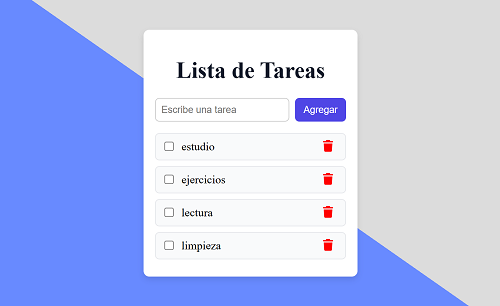

# 📝 To-Do App (Lista de Tareas en React)

Una aplicación sencilla de lista de tareas desarrollada con **React + Vite**.  
Este proyecto forma parte de un **camino de aprendizaje paso a paso**, aplicando **conceptos básicos, intermedios y buenas prácticas** de React.

---

## 📸 Captura de Pantalla

> *(Reemplaza `screenshot.png` con una captura real de tu proyecto y súbela en la raíz del repo).*

---

## 🚀 Funcionalidades

- ✅ Agregar nuevas tareas.  
- ✅ Marcar tareas como completadas.  
- ✅ Eliminar tareas de la lista.  
- ✅ Guardar historial en **LocalStorage** (las tareas no se pierden al recargar).  
- ✅ Estilos aplicados con **CSS Modules** para mantener el código organizado.  

---

## 🛠️ Tecnologías usadas

- [React](https://react.dev/) (con Hooks `useState` y `useEffect`)  
- [Vite](https://vitejs.dev/) para el entorno de desarrollo rápido  
- CSS Modules (`.module.css`) para estilos locales y organizados  

---

## 🧠 Conceptos de React aplicados

- **useState** → manejo de estado (lista de tareas, input del usuario).  
- **useEffect** → sincronización con LocalStorage.  
- **Props** → pasar funciones y valores entre componentes.  
- **Componentes reutilizables** → separación en `TaskInput`, `TaskList`, `TaskItem`.  
- **CSS Modules** → estilos aislados por componente.  

---